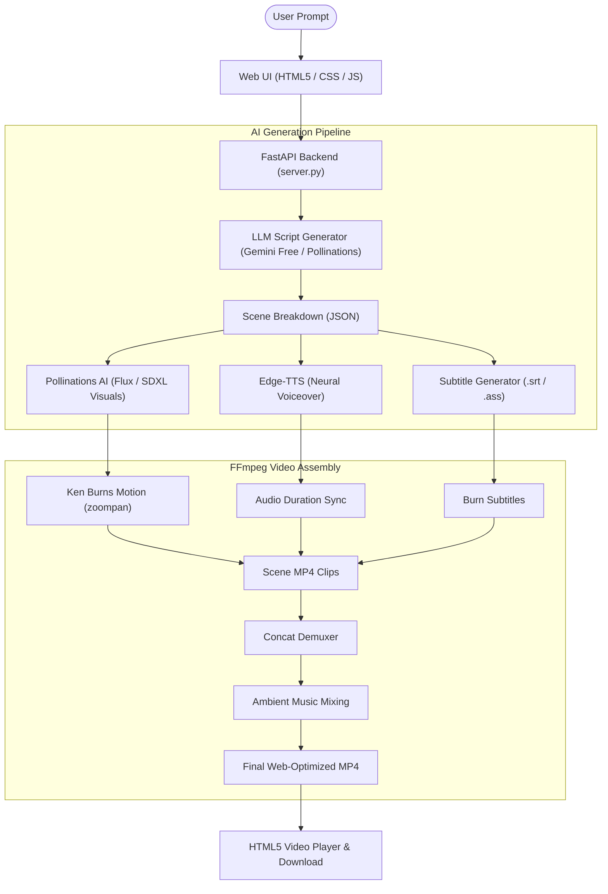

# AI Prompt-to-Video Studio

An end-to-end automated video generation system that converts text prompts into fully produced MP4 videos with scriptwriting, scene storyboarding, AI neural voiceover, high-resolution visuals, dynamic camera movement, subtitles, and ambient music mixing using **FFmpeg** and **100% Free APIs**.

---

## Key Features

1. **Prompt to Script**:
   - Accepts any text prompt or creative concept.
   - Generates a scene-by-scene script with hooks, narration, and optimized AI visual prompts.
   - Supports **Google Gemini Free API** (`gemini-1.5-flash` / `gemini-2.5-flash`), **Pollinations Free Text API** (Zero keys required), or intelligent local fallback.

2. **Neural Voiceover & Subtitles**:
   - High-fidelity natural voiceovers powered by **Microsoft Edge-TTS** (100% free, 0 API keys required).
   - 12+ voices across English (US/UK/India), Spanish, French, German, and Japanese.
   - Synchronized subtitles burned directly into the video with customizable styling (Yellow viral TikTok style, Minimal White, Cyber Cyan, Gold).

3. **AI Visual Generation**:
   - Generates scene images matching the script using **Pollinations AI** (Flux / SDXL models).
   - Generates in exact aspect ratios (16:9 Landscape for YouTube or 9:16 Portrait for Shorts/TikTok/Reels).

4. **FFmpeg Video Engine**:
   - Smooth **Ken Burns** motion (alternating camera zooms and subtle drifts).
   - Precise audio-video synchronization based on spoken duration.
   - Built-in soothing ambient background music ducked underneath the voiceover.
   - Faststart MP4 encoding for immediate web playback.

5. **Two Production Modes**:
   - ** 1-Click Fast Video**: Generates the complete MP4 video automatically in one click.
   - ** Storyboard Studio**: Generates the script and scenes first, allowing you to edit the narration, tweak visual prompts, and preview before rendering.

---

##  System Architecture



---

##  Quick Start Guide

### 1. Launch the Server
Open PowerShell in this directory and run:
```powershell
python -m uvicorn server:app --host 127.0.0.1 --port 8000 --reload
```
Or double-click:
- `run.bat` (Windows Batch)
- `run.ps1` (PowerShell)

### 2. Open the Web App
Open your browser and visit:
 **[http://127.0.0.1:8000](http://127.0.0.1:8000)**

### 3. Generate a Video
1. Enter your idea in the prompt box (or click one of the quick idea chips like *Ocean Depths* or *Brain Tricks*).
2. Choose your preferred **Aspect Ratio** (16:9 Landscape or 9:16 Vertical Reel).
3. Pick a **Narrator Voice** (you can click the preview button to listen).
4. Click **" Generate Full Video"** and watch the live progress bar and terminal logs!

### 4. Stock Video Footage (optional, recommended)
Reels look best with real moving footage. Download the free Pexels clip library once (~485 MB, 50 clips):
```powershell
python download_reel_clips.py
```
Clips land in `reel_clips/` (gitignored) as `{category}{NN}.mp4` across 10 categories: `nature_sunrise_`, `nature_fire_`, `nature_water_`, `mood_rain_`, `human_study_`, `human_walk_`, `urban_city_`, `human_write_`, `mood_calm_`, `india_crowd_`.

With **"Use Stock Video Clips"** on (the default), every scene is cut into shots of **at most 4 seconds**, each a different clip: a 9-second line becomes three 3-second shots. Clips come from the scene's `FOOTAGE:` categories in order (or are matched from its words), are cropped to fill the frame, and are not reused within a reel until the library runs out. If `reel_clips/` is empty, or a render fails, that scene falls back to an AI image with Ken Burns motion.

To add your own footage, drop `.mp4` files into `reel_clips/` named `<category>_NN.mp4`. New categories are picked up by keyword (the category name itself), and you can add keywords for them in `FOOTAGE_CATEGORIES` in `clip_library.py`.

### Photos of quoted people
When a scene mentions **Swami Vivekananda** (or *Vivekanand*, *Swamiji*) — or has `FOOTAGE: vivekananda` — its shots use his historical photographs from `assets/figures/vivekananda/` (public domain, see `CREDITS.md` there) instead of stock clips, each shown whole on a blurred backdrop with a slow push-in, still at most 4 seconds per photo. This works even with stock clips switched off. To add someone else, create `assets/figures/<name>/` with their photos; scenes mentioning `<name>` pick them up (extra spellings go in `FIGURE_ALIASES` in `clip_library.py`).

### 5. Background Music
Three motivational tracks from Pixabay Music (free, no attribution required) ship in `assets/music/` — see `assets/music/CREDITS.md`. Pick one in the **Background Music** dropdown or leave it on *Random*. The music loops or trims to the reel's length, fades in and out, and automatically ducks under the narration. Drop more `.mp3` files into `assets/music/` to add them to the dropdown.

### Script Format
The prompt **is** the script — narration is spoken exactly as you write it. Use this format (also available from the **📋 Blank Template** button):
```
TITLE: Arise. Awake.

SCENE: Third attempt. Failed. Arjun stared at the rejection letter.
CAPTION: 3rd attempt. Failed.
FOOTAGE: mood_rain

SCENE: He opened his phone and typed: I want to give up.
FOOTAGE: urban_city, human_walk

SCENE: Arise, awake, and stop not till the goal is reached.
CAPTION: Arise. Awake. Stop not.
VISUAL: sunrise over the mountains
```
| Key | Required | Meaning |
| :--- | :--- | :--- |
| `TITLE:` | no | Reel title (defaults to the first line) |
| `SCENE:` | **yes** | Narration, spoken word for word. Each `SCENE:` starts a new scene; `SCENE 2:` numbering also works |
| `CAPTION:` | no | On-screen subtitle (defaults to the narration) |
| `FOOTAGE:` | no | Stock categories, comma-separated, used in order across the scene's shots: `nature_sunrise`, `nature_fire`, `nature_water`, `mood_rain`, `human_study`, `human_walk`, `urban_city`, `human_write`, `mood_calm`, `india_crowd` |
| `VISUAL:` | no | Extra words for clip matching / the AI-image fallback |

Lines without a key continue the previous field. **Plain text** without `SCENE:` lines is also read verbatim, split by sentence across the scene-count slider. Start a prompt with **`WRITE:`** (e.g. `WRITE: why youth should read Vivekananda`) to have the script written for you instead — by Gemini if you've added a key, otherwise Pollinations or the built-in offline writer.

---

##  Free API Keys (Zero Configuration Required!)

| Service | Provider | Cost | API Key Required? |
| :--- | :--- | :--- | :--- |
| **Script Generation** | Pollinations Text API / Fallback | 100% Free | ❌ **No Key Needed** |
| **Script Generation (Optional)** | Google Gemini (`gemini-1.5-flash`) | Free Tier | ✅ Free key from [Google AI Studio](https://aistudio.google.com/app/apikey) |
| **Voiceover (TTS)** | Microsoft Edge-TTS | 100% Free | ❌ **No Key Needed** |
| **Visuals / Artwork** | Pollinations AI (Flux / SDXL) | 100% Free | ❌ **No Key Needed** |
| **Video Assembly** | FFmpeg | Open Source | ❌ **No Key Needed (Bundled)** |

*(If you want to use your free Google Gemini API key, click **"Keys & Config"** in the top-right corner of the app and paste it in. It will be stored locally in your browser).*

---

## 📁 Project Structure

```
prompt-to-video/
├── config.py            # Global paths, voice list, styles, ffmpeg resolver
├── llm_service.py       # Script generation with Gemini / Pollinations / Fallback
├── tts_service.py       # Edge-TTS voice synthesis & SRT subtitle generation
├── image_service.py     # Pollinations AI image fetcher & canvas fallback
├── video_service.py     # FFmpeg Ken Burns motion, stock-clip rendering, subtitles & music
├── clip_library.py      # Indexes reel_clips/ and matches stock clips to scenes
├── download_reel_clips.py      # Downloads the Pexels clip library into reel_clips/
├── reel_clips_manifest.json    # Pexels clip URLs used by the downloader
├── pipeline.py          # Master orchestrator with real-time job status tracking
├── server.py            # FastAPI REST backend & static web server
├── requirements.txt     # Python dependencies
├── run.bat              # 1-click Windows batch launcher
├── run.ps1              # PowerShell launch script
├── static/
│   ├── index.html       # Responsive web UI
│   ├── style.css        # Studio dark theme & glassmorphic styling
│   └── app.js           # Frontend interactivity & real-time polling
├── output/              # Final rendered MP4 videos & metadata JSON
└── temp/                # Intermediate audio, image, and clip cache
```
