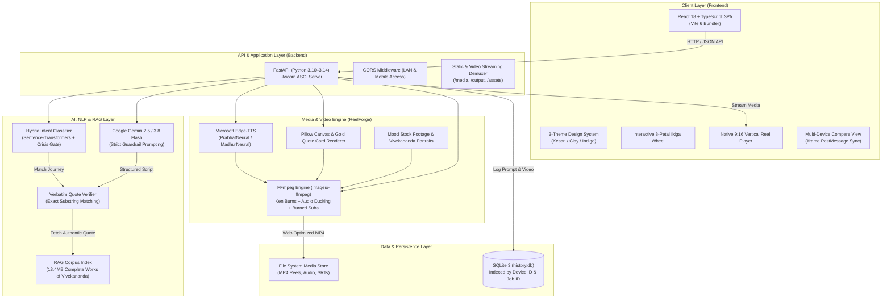

# SwamiSays — Technology Stack & Architecture Specification

## 1. Executive Summary

**SwamiSays** is an AI-powered wisdom and short-form video generation platform designed to bridge Swami Vivekananda's timeless teachings with the daily psychological dilemmas of Gen Z and Gen Alpha. 

The system implements an authenticity-first architecture: transforming user dilemmas into 30–60 second vertical reels (9:16) with verified citations from *The Complete Works of Swami Vivekananda* (CWSV), neural voiceovers, dynamic visuals, and burned subtitles—while ensuring **zero quote hallucination**.

---

## 2. High-Level Architecture Diagram

---

## 3. Technology Stack Breakdown by Layer

### 3.1 Frontend (Client Application)
* **Core Framework**: React `18.3.1`
* **Language**: TypeScript `5.6.3` (Strict type safety, end-to-end interface contracts)
* **Build Tool & Bundler**: Vite `6.0.1` (Hot Module Replacement, tree-shaking, Rollup production bundle)
* **Routing**: React Router DOM `6.28.0` (Client-side SPA routing with nested paths)
* **Design System & Styling**:
  * **Pure CSS Custom Properties (CSS Variables)** — Zero runtime CSS-in-JS overhead.
  * **3 Curated Visual Themes**:
    1. **Kesari (Sunrise Caramel)**: Warm optimism, serif elegance (`Fraunces`).
    2. **Chai & Clay (Earthen)**: Dark contemplative palette (`Cormorant Garamond`).
    3. **Indigo & Marigold (Belur Math Legacy)**: Majestic spiritual contrast (`DM Serif Display`).
  * **Design Tokens**: Standardized spacing, shadows, border radii, and fluid typography.
* **Specialized UI Components**:
  * **Ikigai Wheel**: 8-petal SVG sacred geometry mandala featuring drag/touch gestures, keyboard navigation, and idle ambient rotation.
  * **9:16 Vertical Reel Player**: Touch-optimized vertical video playback, dynamic captions, fallback speech synthesis, and audio progress bar.
  * **Live Multi-Theme Compare View**: Dual phone/laptop device simulator with bi-directional `postMessage` synchronization.
  * **QuoteCard Component**: Gold-framed visual container for verified quotes with explicit book and chapter source tags.
  * **AiLabel Component**: Transparency UI element clearly delineating modern AI narrative from historical scripture.
* **Client-Side Persistence & State**:
  * `localStorage`: Theme preferences, lesson completion progress, persistent anonymous device UUID (`sva_device_id`).

---

### 3.2 Backend (API & Orchestration Layer)
* **Runtime**: Python `3.10+` (compatible up to `3.14`)
* **API Framework**: FastAPI `0.110.0+`
* **ASGI Server**: Uvicorn `0.28.0+` (Asynchronous event loop, multi-worker capability, host binding `0.0.0.0:8000` for seamless mobile LAN testing)
* **Validation & Schemas**: Pydantic `v2.0.0+` (Type-safe input/output models for API contracts)
* **Static File Streaming**: Starlette `StaticFiles` and `FileResponse` for streaming fast-start MP4 videos, audio buffers, and production SPA assets.
* **Cross-Origin Resource Sharing**: `CORSMiddleware` supporting mobile browser requests across local network subnets.

---

### 3.3 AI, NLP & RAG Engine
* **Primary LLM**: Google Gemini API (`gemini-2.5-flash`, `gemini-3.8-flash`, `gemini-3.5-flash-lite`) via Google Generative Language API.
  * **System Constraints**: Strictly enforces 30–60 second duration target, sub-135 spoken word count, and 5-scene narrative arc (Hook → Modern Situation → Verbatim Teaching → 2-Minute Action → Outro).
  * **Anti-Hallucination Guardrail**: The LLM only selects candidate quote IDs; the backend programmatically injects the exact verified text from the corpus, preventing any AI paraphrasing of Swami Vivekananda.
* **Fallback NLP Engine**:
  * Deterministic personalized local script engine parameterized by user name, age, and profession.
  * Optional Pollinations AI text endpoint fallback.
* **Semantic Intent Classifier**:
  * **Embedding Model**: `sentence-transformers` (`all-MiniLM-L6-v2`) computing cosine similarity against curated journey seeds across English, Hindi, and Hinglish.
  * **Crisis Intervention Gate**: Pre-classification regex pattern matcher intercepting severe distress or self-harm keywords, instantly providing verified Indian mental health crisis helplines (**Tele-MANAS `14416`**, **KIRAN `1800-599-0019`**).
* **RAG Knowledge Base**:
  * **Corpus**: *The Complete Works of Swami Vivekananda* (CWSV Volumes 1–9 + Unpublished Volume 10).
  * **Index Structure**: 13.4 MB JSONL dataset (`vivekananda_rag_ready.jsonl`), segmented into ~420-word contextual chunks with exact source citations and EPUB locator hashes (`OEBPS/part...xhtml#anchor`).
  * **Integrity Engine**: Verbatim substring verification (`quotes.py`) ensuring zero divergence between displayed quotes and historical publications.

---

### 3.4 Media, Audio & Video Rendering (ReelForge Engine)
* **Video Compositing Core**: FFmpeg (`imageio-ffmpeg` binary distribution).
  * **Visual Motion**: Sub-pixel dynamic camera movement using the Ken Burns effect (`zoompan` filter with smooth interpolation).
  * **Audio Engineering**: Background music ducking using FFmpeg complex filter graphs (`anoisesrc`, `sine`, `amix`, `afade`), lowering ambient volume during spoken narration.
  * **Subtitle Burner**: Dynamic `.srt` timestamp generation with chunked rhythm, burned into MP4 frames using system fonts (`Nirmala UI` on Windows for seamless Devanagari and Latin script rendering).
  * **Web Encoding**: MP4 container with H.264 video codec, AAC audio, and `+faststart` demuxing flags for instant web playback before full download.
* **Neural Text-to-Speech (TTS)**:
  * **Engine**: Microsoft Edge-TTS (`edge-tts` async library, 100% free, zero external API keys needed).
  * **Voices**: High-naturalness neural voices:
    * English: `en-IN-PrabhatNeural`
    * Hindi: `hi-IN-MadhurNeural`
  * **Backup**: Google TTS (`gTTS`).
* **Visual Canvas & Graphic Generation**:
  * **Engine**: Python Imaging Library (`Pillow` / `PIL`).
  * **Generated Assets**:
    * 720×1280 9:16 gold-framed sacred quote cards displaying Vivekananda's verbatim quotes and source metadata.
    * Dynamically rendered journey background canvases with specialized color palettes for all 8 life dilemma categories.
* **Stock & Archival Media Library**:
  * Curated vertical HD video assets organized into thematic categories (`nature_fire`, `nature_sunrise`, `mood_rain`, `human_study`, `human_walk`, `india_crowd`, `mood_calm`).
  * Archival historical photographic portraits of Swami Vivekananda.

---

### 3.5 Database & Persistence Layer
* **Database Engine**: SQLite 3 (`backend/data/history.db`).
* **Schema**:
  * `reel_history` table: Persists prompt, client device UUID, user profile (name, age, profession), language, matched journey, verified quote citation, scene breakdown JSON, video URL, rendering status, and Gemini model verification logs.
* **Indexing**: B-Tree indices on `device_id` and `job_id` for $O(1)$ query retrieval.
* **File System Storage**: Structured storage directories for pre-rendered episodes (`media/episodes`), generated SOS reels (`media/reels`), and ReelForge project outputs (`ReelForge-video_generator/output`).

---

### 3.6 Tooling, DevOps & Testing
* **Test Suite**: `pytest` running automated test cases for:
  * Semantic classifier accuracy and crisis keyword detection (`test_classifier.py`).
  * Verbatim quote corpus integrity and chunk validation (`test_quotes.py`).
  * Backend API endpoints and error boundaries (`test_server.py`).
  * ReelForge studio generation pipeline (`test_forge_api.py`).
* **Configuration & Environment**: `python-dotenv` managing environment variables with graceful zero-key fallbacks.
* **Cross-Device Testing**: Custom PowerShell (`run_studio.ps1`) and Batch (`run_studio.bat`) startup routines that automatically detect the machine's local IPv4 network address and print a scannable mobile URL.

---

## 4. Tech Stack Summary Matrix

| Domain | Technology / Library | Version | Purpose in Project |
| :--- | :--- | :--- | :--- |
| **Frontend Framework** | React | `18.3.1` | Component-based UI and reactive views |
| **Language (Client)** | TypeScript | `5.6.3` | Type safety and domain contracts |
| **Frontend Bundler** | Vite | `6.0.1` | Rapid dev server & production bundling |
| **Routing** | React Router DOM | `6.28.0` | Client-side navigation & deep linking |
| **Frontend Styling** | Pure CSS3 Variables | Native | Theme engine (Kesari, Clay, Indigo) |
| **Backend Runtime** | Python | `3.10–3.14` | High-performance async server runtime |
| **API Framework** | FastAPI | `>=0.110.0` | REST API, OpenAPI docs, background tasks |
| **ASGI Server** | Uvicorn | `>=0.28.0` | Asynchronous HTTP server |
| **Data Validation** | Pydantic | `>=2.0.0` | Request/response data models & validation |
| **Primary LLM** | Google Gemini API | `Flash 2.5 / 3.8` | Scriptwriting, scene breakdown, takeaways |
| **Semantic Embeddings** | Sentence-Transformers | `all-MiniLM-L6-v2` | 8-Journey dilemma intent classification |
| **Knowledge Corpus** | CWSV Corpus | JSONL (13.4MB) | 10 volumes of Vivekananda works with EPUB locators |
| **Video Engine** | FFmpeg (`imageio-ffmpeg`) | `>=0.5.1` | 9:16 MP4 assembly, Ken Burns, audio mix |
| **Neural TTS** | Microsoft Edge-TTS | `>=6.1.9` | Indian English and Hindi neural voiceover |
| **Image Generation** | Pillow (PIL) | `>=10.0.0` | 720x1280 gold quote cards and scene canvases |
| **Database** | SQLite 3 | Embedded | Local user reel generation history |
| **Testing** | pytest | `>=8.0.0` | Unit & integration testing |
